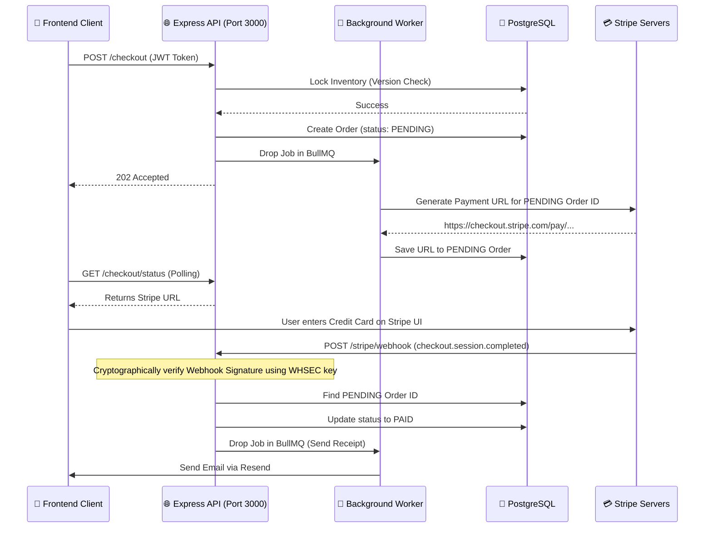

# The Asynchronous Checkout Flow

This document details the exact chronological sequence of the two-step asynchronous payment pipeline.

## The Problem with "Fake" Checkout
In a basic CRUD tutorial, a user clicks "Checkout", the API deducts the inventory, and instantly marks the order as `PAID`. However, in the real world, the user might click checkout, be redirected to the payment gateway (Stripe), and then close their browser without entering their credit card. If the order is instantly marked `PAID`, the system gives away free inventory.

## The Two-Step Pipeline

We implemented a robust, webhook-driven checkout pipeline that completely bypasses the frontend client to prevent spoofing.

### Edge Case Handling (Abandoned Carts)
If a user closes their browser at the Stripe UI step, the PostgreSQL database contains a `PENDING` order, and the inventory remains locked indefinitely. 

To resolve this, we implemented a **Cron Job** (`node-cron`). It runs a database sweep on a schedule, finding all `PENDING` orders older than a specified timeout. It executes a massive Prisma Transaction to restore the `Product` inventory and delete the abandoned `Order` and `OrderItem` rows, ensuring inventory is never permanently lost.
